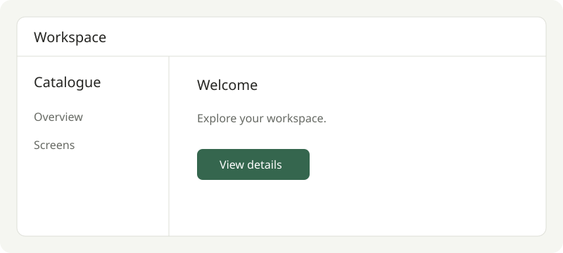

# Workspace guide

Keep the screen and its guidance together as you explore the workspace.

## Your first visit

1. Open the [welcome screen](mock:./screens/welcome).
2. Select **View details** to continue to the detail screen.
3. Use the catalogue to return to the [Example overview](README.md#start-here).

## Choose a view

| View    | What you can explore                     |
| ------- | ---------------------------------------- |
| Mobile  | The compact layout and navigation drawer |
| Desktop | The wide layout and details panel        |
| Both    | The two layouts side by side             |

Use Light or Dark to see the supported appearance. A screen with one appearance
keeps that appearance when you change the catalogue setting.

## Before you finish

- [ ] Follow the complete user journey.
- [ ] Read the details for the screens you changed.
- [ ] Check each supported appearance.

Return to [Your first visit](#your-first-visit) or read
[Getting started](mock:./getting-started#next-steps).
